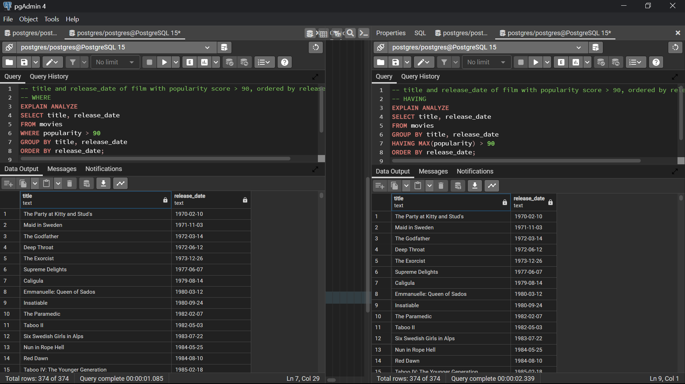

# Performance Comparison of SQL Queries Using WHERE and HAVING Clauses

## Introduction

This repository contains an analysis of SQL query performance using the PostgreSQL database, focusing on the usage and impact of WHERE and HAVING clauses in different scenarios. The dataset used for these experiments consists of 1,000,000 rows from The Movie Database (TMDb), providing various attributes about movies.

## Dataset Description

The dataset is taken from [Kaggle](https://www.kaggle.com/datasets/asaniczka/tmdb-movies-dataset-2023-930k-movies), including the following attributes:
| Attribute             | Description                                                  | Type    |
|-----------------------|--------------------------------------------------------------|---------|
| id                    | Unique identifier for each movie                              | int     |
| title                 | Title of the movie                                            | str     |
| vote_average          | Average vote or rating given by viewers                       | float   |
| vote_count            | Total count of votes received for the movie                   | int     |
| status                | The status of the movie (e.g., Released, Rumored)            | str     |
| release_date          | Date when the movie was released                              | str     |
| revenue               | Total revenue generated by the movie                          | int     |
| runtime               | Duration of the movie in minutes                              | int     |
| adult                 | Indicates if the movie is suitable only for adult audiences   | bool    |
| backdrop_path         | URL of the backdrop image for the movie                       | str     |
| budget                | The budget of the movie                                       | int     |
| homepage              | The homepage of the movie                                     | str     |
| imdb_id               | The IMDb identifier for the movie                             | str     |
| original_language     | The original language of the movie                            | str     |
| original_title        | The original title of the movie                               | str     |
| overview              | A brief overview or summary of the movie                      | str     |
| popularity            | The popularity score of the movie                             | float   |
| poster_path           | URL of the poster image for the movie                         | str     |
| tagline               | The tagline of the movie                                      | str     |
| genres                | The genres of the movie (comma-separated)                     | str     |
| production_companies  | The production companies of the movie (comma-separated)       | str     |
| production_countries  | The production countries of the movie (comma-separated)       | str     |
| spoken_languages      | The spoken languages in the movie (comma-separated)           | str     |
| keywords              | Keywords associated with the movie (comma-separated)          | str     |


## Queries and Performance Analysis

### Query 1: Number of films with a budget greater than 100,000,000 by original language

*Both queries using `WHERE` and `HAVING` produce same output*


#### Using `WHERE` Clause
```sql
EXPLAIN ANALYZE
SELECT original_language, MAX(budget) AS max_budget
FROM movies
WHERE budget > 100000000
GROUP BY original_language;
```

#### Execution Plan:
```sql
Finalize GroupAggregate  (cost=71831.30..71863.50 rows=115 width=11) (actual time=194.640..200.940 rows=13 loops=1)
Group Key: original_language
->  Gather Merge  (cost=71831.30..71861.20 rows=230 width=11) (actual time=194.632..200.924 rows=17 loops=1)
        Workers Planned: 2
        Workers Launched: 2
        ->  Partial GroupAggregate  (cost=70831.28..70834.62 rows=115 width=11) (actual time=168.932..168.983 rows=6 loops=3)
            Group Key: original_language
            ->  Sort  (cost=70831.28..70832.01 rows=293 width=11) (actual time=168.922..168.938 rows=168 loops=3)
                    Sort Key: original_language
                    Sort Method: quicksort  Memory: 50kB
                    Worker 0:  Sort Method: quicksort  Memory: 26kB
                    Worker 1:  Sort Method: quicksort  Memory: 25kB
                    ->  Parallel Seq Scan on movies  (cost=0.00..70819.27 rows=293 width=11) (actual time=18.310..168.709 rows=168 loops=3)
                        Filter: (budget > 100000000)
                        Rows Removed by Filter: 351315
Planning Time: 0.129 ms
Execution Time: 200.993 ms
```
#### Using `HAVING` Clause
```sql
EXPLAIN ANALYZE
SELECT original_language, MAX(budget) AS max_budget
FROM movies
GROUP BY original_language
HAVING MAX(budget) > 100000000;
```
#### Execution Plan:
```SQL
Finalize GroupAggregate  (cost=72923.04..72952.46 rows=38 width=11) (actual time=257.471..263.621 rows=13 loops=1)
Group Key: original_language
Filter: (max(budget) > 100000000)
Rows Removed by Filter: 161
->  Gather Merge  (cost=72923.04..72949.87 rows=230 width=11) (actual time=257.437..263.540 rows=467 loops=1)
        Workers Planned: 2
        Workers Launched: 2
        ->  Sort  (cost=71923.01..71923.30 rows=115 width=11) (actual time=233.639..233.643 rows=156 loops=3)
            Sort Key: original_language
            Sort Method: quicksort  Memory: 33kB
            Worker 0:  Sort Method: quicksort  Memory: 33kB
            Worker 1:  Sort Method: quicksort  Memory: 33kB
            ->  Partial HashAggregate  (cost=71917.93..71919.08 rows=115 width=11) (actual time=233.359..233.374 rows=156 loops=3)
                    Group Key: original_language
                    Batches: 1  Memory Usage: 48kB
                    Worker 0:  Batches: 1  Memory Usage: 48kB
                    Worker 1:  Batches: 1  Memory Usage: 48kB
                    ->  Parallel Seq Scan on movies  (cost=0.00..69720.62 rows=439462 width=11) (actual time=0.343..137.675 rows=351484 loops=3)
Planning Time: 0.077 ms
Execution Time: 263.660 ms
```

`Observation:`
- The **WHERE clause query was faster**, taking approximately 200.993 ms compared to 263.660 ms for the HAVING clause query. 
### Query 2: Title and release date of films with a popularity score greater than 90, ordered by release date
*Both queries using `WHERE` and `HAVING` produce same output*

#### Using `WHERE` Clause
```sql
EXPLAIN ANALYZE
SELECT title, release_date
FROM movies
WHERE popularity > 90
GROUP BY title, release_date
ORDER BY release_date;
```
#### Execution Plan:
```sql
Group  (cost=71875.96..72153.86 rows=2682 width=32) (actual time=209.832..215.606 rows=374 loops=1)
  Group Key: release_date, title
  ->  Gather Merge  (cost=71875.96..72142.67 rows=2238 width=32) (actual time=209.831..215.525 rows=374 loops=1)
        Workers Planned: 2
        Workers Launched: 2
        ->  Group  (cost=70875.94..70884.33 rows=1119 width=32) (actual time=186.001..186.039 rows=125 loops=3)
              Group Key: release_date, title
              ->  Sort  (cost=70875.94..70878.73 rows=1119 width=32) (actual time=185.997..186.006 rows=125 loops=3)
                    Sort Key: release_date, title
                    Sort Method: quicksort  Memory: 47kB
                    Worker 0:  Sort Method: quicksort  Memory: 28kB
                    Worker 1:  Sort Method: quicksort  Memory: 28kB
                    ->  Parallel Seq Scan on movies  (cost=0.00..70819.27 rows=1119 width=32) (actual time=0.673..185.489 rows=125 loops=3)
                          Filter: (popularity > '90'::double precision)
                          Rows Removed by Filter: 351359
Planning Time: 0.110 ms
Execution Time: 215.653 ms
```
#### Using `HAVING` Clause
```sql
EXPLAIN ANALYZE
SELECT title, release_date
FROM movies
GROUP BY title, release_date
HAVING MAX(popularity) > 90
ORDER BY release_date;
```
#### Execution Plan:
```sql
Sort  (cost=212812.10..213242.26 rows=172067 width=32) (actual time=2097.812..2097.825 rows=374 loops=1)
  Sort Key: release_date
  Sort Method: quicksort  Memory: 54kB
  ->  HashAggregate  (cost=170796.80..193729.13 rows=172067 width=32) (actual time=1275.423..2096.885 rows=374 loops=1)
        Group Key: release_date, title
        Filter: (max(popularity) > '90'::double precision)
        Planned Partitions: 16  Batches: 81  Memory Usage: 9105kB  Disk Usage: 80136kB
        Rows Removed by Filter: 1044874
        ->  Seq Scan on movies  (cost=0.00..75873.08 rows=1054708 width=40) (actual time=0.292..341.610 rows=1054451 loops=1)
Planning Time: 0.092 ms
Execution Time: 2119.136 ms
```
`Observation:` 
- The **WHERE clause query was significantly faster**, taking approximately 215.653 ms compared to 2119.136 ms for the HAVING clause query.
### Explanation for Runtime Difference
**`WHERE`:** Filters rows before any grouping and aggregation are done -> Reduces the dataset size early on, making subsequent operations like grouping and aggregation faster and more efficient.

**`HAVING`:** Filters rows after the grouping and aggregation have been performed -> the entire dataset must be processed for grouping and aggregation first, which can be significantly slower, especially with large datasets.
## Conclusion
From the experiments and analysis, it is clear that:
- The `WHERE` clause is generally faster than the `HAVING` clause when used to filter rows before aggregation.
- The performance difference can be substantial, especially when the filtering condition significantly reduces the number of rows before the aggregation step.

Therefore, whenever possible, it is recommended to use the WHERE clause for filtering conditions that do not depend on aggregate functions, as this can lead to more efficient query execution. The HAVING clause should be reserved for filtering conditions that need to be applied after the aggregation has been performed.